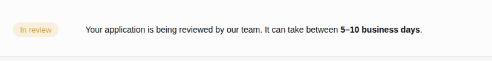

# Unsplash RESTful API
This is a simple full-stack Flask application school mini-project that demonstrates how to get remote data from an image discovery platform called [Unsplash](https://unsplash.com) using a RESTful API. The remote data consumed is used to generate images depending on on the **category** query parameter used in the endpoint.

## Project contribution
The following developers contributed to the project:
1. Samantha Bora
2. Ronaldo Nyakwama
3. Joshua Odero

## Application features
This application has the following features:

### a. Category navigation
This is a navigation section which contains tabs of different categories. When a user clicks on any of the tabs, they navigate to a gallery page containing all the images of that particular category.

### b. Image gallery
This is a page where a user bnavigates to when they click a tab in the category navigation.
It contains a collection of images of a particular category. Behind the scenes, data is fetched with a query parameter.

### c. Flask templates
They are created from [index.html](templates/index.html) and [gallery.html](templates/gallery.html) and they are used to render the **category navigation** and **image gallery** in the browser respectively.

### d. API integration
Data used to generate images is fetched using a RESTful API. The following endpoint was used to was used to fetch photos data:

```bash
https://api.unsplash.com/search/photos
```
with the following query parameters: 
- **query** with image category as its value
- **per_page** which describes the number of images to generate as an integer
- **client_id** with the **access key** as its value

## Challenges and solution

- **Notification after creating an app.** As a group we could not understand why we had to wait for 5 to 10 business days for the Unsplash's technical team to review created app yet we could still fetch data from their API.

- **Solution.** We created [a simple script](test.py) to test whether we can fetch data without app approval. We were also able to track number of requests by printing the response object's **status_code** and **headers**:

```bash
X-Ratelimit-Limit: 50
X-Ratelimit-Remaining: 49
```



